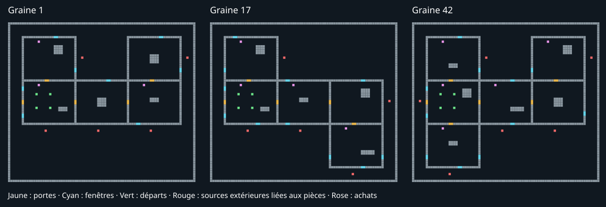
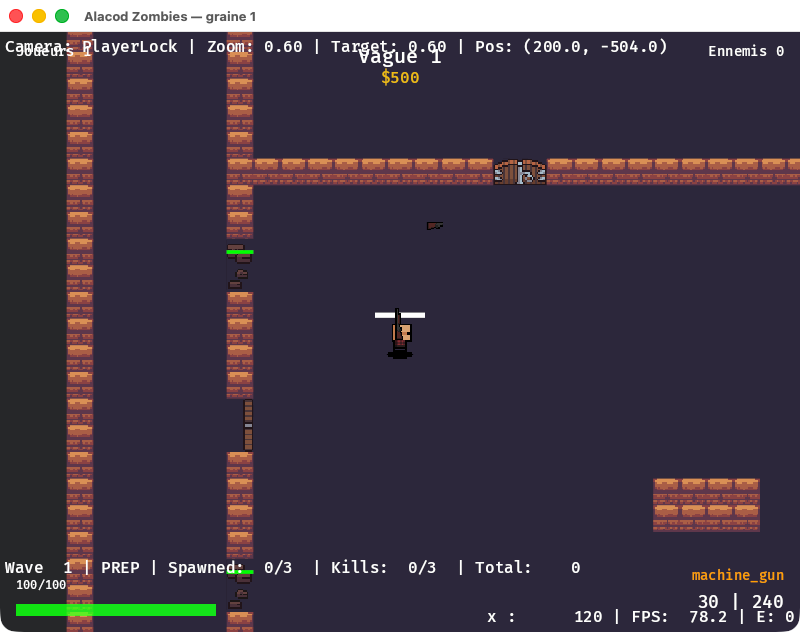
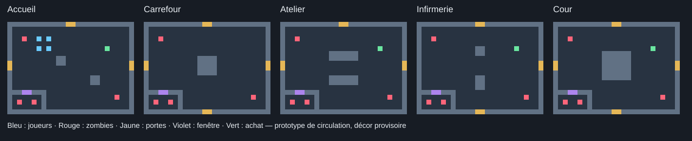

# Le Relais — composition procédurale

La version du 2026-10-09 assemble **5 à 8 pièces parmi 14 modules LDtk**.
Les pièces choisies, portes, raccourcis, achats et fenêtres changent par graine.
Les spawners restent dehors et sont liés aux pièces ; deux fenêtres sont garanties
à l'accueil. Seules les connexions entre deux pièces ont une porte ;
les façades sans voisin sont des murs ou des fenêtres. Chaque porte coûte 750 points. L'atelier est à au plus deux portes
et la radio à deux à quatre portes. La radio et l'évacuation ne sont pas encore
interactives. Les modules ont tous la même emprise (384 × 320 px), avec obstacles
différents ; le bâtiment produit occupe une carte de 1312 × 1120 px.



Les [modules éditables](../../../games/zombies/assets/maps/le_relais_modules.ldtk)
se reconstruisent avec `python3 scripts/construire-modules-le-relais.py`.
Les [cartes de référence](cartes/) sont des sorties du même générateur Rust
que le jeu, pour les graines 1, 17 et 42. Elles s'ouvrent directement dans LDtk.
Pour produire une autre carte :

```sh
APP_VERSION=x cargo run --example map_generation --profile headless --no-default-features -- games/zombies/assets/maps/le_relais_modules.ldtk /tmp/relais.ldtk 17
```

Les chemins des tilesets d'une sortie déplacée doivent être rendus relatifs à
son nouveau dossier (les trois références ci-dessus le font déjà).

Le jeu local choisit une nouvelle graine avant la simulation à chaque partie.
Le titre de fenêtre indique la graine ; `--seed 17` permet de la rejouer.
Les enregistrements capturent cette graine. Le réseau conserve la graine du
manifeste ; la négociation d'une graine aléatoire en ligne reste à faire.

Les tests sur 200 graines trouvent **184 plans fonctionnels distincts**, après
normalisation des translations, rotations et réflexions, sans compter les
variantes de sprites ou de modules ayant le même rôle. Ils vérifient le graphe,
les distances à la radio, la reproductibilité et le passage des corps de zombies
de chaque spawner jusqu'à l'accueil lorsque les portes restent fermées.

## Correction après la partie de William




Retour : carte trop petite, achats dans les passages/chevauchés, apparitions
sans tenir compte de la pièce occupée. Les modules passent à 384 × 320 px,
soit quatre fois la surface d'une pièce. Un emplacement de 48 × 48 px est
réservé aux achats au point (7,2), à l'écart de l'axe des portes ; les tests
vérifient les murs, les portes et l'écart entre stations sur 200 graines.
Les repères LDtk WeaponLocation, PlayerSpawn et ZombieSpawn ne sont plus dessinés
en jeu. L'arme conserve son rendu réel ; le soda garde son sprite LDtk, car la
machine créée par la simulation n'a pas de second sprite.

Chaque pièce possède une source extérieure associée par active_x/active_y/
active_width/active_height (coordonnées mondiales LDtk en pixels). Une source s'active quand au moins un
joueur se trouve dans cette pièce, sans attendre le seuil de distance de
l'ancien système. Une pièce intérieure sans façade utilise la source extérieure
la plus proche. Le secours de distance reste limité aux pièces occupées ; si
tous les joueurs sont dehors, le secours de proximité peut reprendre les apparitions pour éviter de
bloquer la vague. Les cartes sans ces champs
gardent leur sélection historique. Aucun contrat de salles/objets M2 modifié.

La géométrie et la lecture des bindings passent sur 200 graines ; les quatre
tests de sélection de vagues passent (déplacement de joueur, joueurs répartis,
secours et comportement historique). La trace bots_four_mixed et le replay
restent inchangés. Les mesures de combat précédentes ci-dessous concernent la
petite version et ne constituent pas une validation humaine de celle-ci.

## Historique : mesure avant retrait de la sortie extérieure

Quatre acheteurs, graines 1..20, jusqu'à l'entrée en V5, plafond 20000 frames :
**20/20**, 0 mort, 0 mise à terre, 0 desync, 0 failure, aucun soft-lock rapporté.
Dégâts cumulés : **9**. V5 f5891–f12006, médiane f6298,5 ; 118 portes achetées.
La V3 de la graine 9 dure 4857 frames du premier spawn à sa fin (81 s) ; la graine
13 atteint V5 f12006. Les bots sortant du bâtiment peuvent déclencher le secours
des sources et étirer la cadence : ces résultats ne prouvent pas un rythme uniforme
ou une validation humaine de la défense intérieure. Voir les
[relevés de cette correction](releves-correction.json). Le combat de V5, le réseau
et la boucle radio/évacuation ne sont pas validés par cette mesure.

## Modifier les modules dans LDtk

Chaque niveau source porte un `building_role` : `Accueil`, `Radio`, `Atelier`,
`Infirmerie`, `Reserve` ou `Passage`. Le niveau doit garder une grille de 16 px,
24 colonnes et 20 lignes, les couches Walls/LevelConnection/Entities et son mur
périphérique. Les rôles Accueil, Radio et Atelier sont obligatoires. Fournir au
moins six modules parmi Atelier/Infirmerie/Reserve/Passage ; le tirage n'utilise
pas deux fois le même module. Les PlayerSpawn sont conservés seulement dans
l'accueil ; WeaponLocation et SodaLocation sont copiés de toutes les pièces.

Garder dégagés les accès de façade : milieu des murs latéraux à la ligne 9,
et milieu des murs haut/bas à la colonne 10 (portes de 32 px). Les fenêtres
latérales prennent deux cases aux lignes 4 ou 14, et celles du haut/bas aux
colonnes 4 ou 14. L'accueil réserve en plus deux fenêtres à gauche aux lignes
3 et 15. Le générateur choisit les ouvertures et les spawners ; ne pas ajouter
ces entités dans les modules. Après un déplacement d'obstacle ou de départ,
rejouer les tests de `generation::building` et les sims : le lint général ne
prouve pas qu'un corps peut circuler.

Les ouvertures et le terrain extérieur emploient les defs et le tileset
SunnyLand du projet. Une migration du tileset demande aussi de mettre à jour
le cache de tuiles produit par le générateur.


## Historique : combat de la première version composée (2026-10-09)

Quatre bots `acheteur`, graines 1..20, arrêt à l'entrée en V5, plafond 20000
frames : **20/20 en V5**, 0 mort, 0 mise à terre, 0 desync, 0 failure, aucun
soft-lock rapporté. Dégâts cumulés : 175 (prototype précédent : 134). V5 entre
f6748 et f7709, médiane f7197,5. Phase de combat la plus longue (premier spawn
à WaveComplete) : 1434 frames, graine 2 / V3, soit 23,9 s à 60 Hz.
Cela ne teste pas le combat de V5, une stratégie humaine ou la négociation réseau.

[Relevés complets par vague et graine](releves-proceduraux.json).

| Graine | Frame V5 | Dégâts | Portes ouvertes |
| --- | ---: | ---: | ---: |
| 1 | 7167 | 20 | 4 |
| 2 | 7483 | 10 | 5 |
| 3 | 7657 | 18 | 5 |
| 4 | 7709 | 13 | 7 |
| 5 | 6764 | 0 | 5 |
| 6 | 7228 | 20 | 7 |
| 7 | 6954 | 30 | 5 |
| 8 | 6992 | 0 | 5 |
| 9 | 7274 | 0 | 5 |
| 10 | 6871 | 0 | 6 |
| 11 | 6894 | 8 | 5 |
| 12 | 7351 | 0 | 7 |
| 13 | 6952 | 0 | 5 |
| 14 | 7388 | 10 | 3 |
| 15 | 6834 | 18 | 5 |
| 16 | 7040 | 0 | 8 |
| 17 | 7639 | 0 | 5 |
| 18 | 7623 | 18 | 7 |
| 19 | 6748 | 10 | 7 |
| 20 | 7318 | 0 | 9 |

## Historique : premier bâtiment compact


William choisit le 2026-10-09 un bâtiment compact à sécuriser, avec les zombies
qui arrivent de l'extérieur. Carte de travail :
`games/zombies/assets/maps/le_relais_prototype.ldtk`. Elle garde les assets actuels
et ne remplace pas encore la carte de départ du jeu.



## Disposition

Chaque plan contient cinq pièces : accueil, atelier, infirmerie, radio et réserve.
Les passages intérieurs sont courts ; quatre portes relient les quatre grandes
zones en boucle et une cinquième donne accès à la réserve. Une sixième porte
permet de sortir dans la cour. Les portes utilisent les prix du générateur actuel
(750 points dans ce niveau unique). La radio et l'extraction ne sont pas encore
interactives ; les noms indiquent leur rôle prévu dans la conception.

- Quatre départs joueurs **dans l'accueil**, avec dégagement pour leurs corps.
- Huit spawners **uniquement dehors**, avec une marge pour l'offset de spawn.
- Huit fenêtres barricadées dans les murs extérieurs : tirs au travers,
  réparation, destruction puis entrée des zombies ; elles bloquent les joueurs.
- Pistolet dans l'accueil, fusil à pompe dans l'atelier, juggernog à l'infirmerie,
  mitraillette dans la réserve.
- Une bande extérieure continue permet aux zombies de contourner le bâtiment
  jusqu'à une fenêtre donnant vers une pièce accessible.

LDtk 1.5.3, grille 16 px, emprise 544 × 480 px (34 × 30 cellules), bâtiment
352 × 288 px extérieur compris. La cour et les cinq pièces forment **un niveau
LDtk unique** : les pièces sont matérialisées par les murs et portes intérieurs.
Le générateur choisit parmi quatre gabarits de départ correspondant aux quatre
réflexions du plan. Ce prototype vérifie la défense du bâtiment ; la composition
procédurale des pièces et les permutations d'équipements restent à construire
avec les interfaces de M2. Quatre orientations ne prouvent pas une variété
stratégique suffisante pour la démo finale.

Le premier prototype assemblait cinq gabarits indépendants avec des spawns
intérieurs. Son pilote était bloqué : le mode vagues sélectionne par distance,
sans filtre par salle, et pouvait choisir un zombie derrière des portes fermées.
Le nouveau plan rend les spawners accessibles depuis l'accueil par l'extérieur
et une fenêtre cassable, même avec toutes les portes fermées. Le moteur n'a
pas été modifié ; ce problème reste pertinent pour d'autres configurations.

## Vérifications

- Lint zombies : aucune erreur.
- Tous les départs joueurs et spawners sont dégagés des murs.
- Flood-fill sur une grille de 8 px avec corps de 20 × 20 px : les huit spawners
  sont reliés à l'accueil, portes fermées et fenêtres considérées franchissables
  par les zombies, pour chacune des quatre orientations.
- Génération native sur graines 1..20 : un bâtiment par carte, quatre plans
  distincts, chacun tiré cinq fois. Les translations du monde sont ignorées.
- Pilote graine 1, quatre acheteurs, jusqu'à l'entrée en vague 5 : **7236 frames**,
  **27 kills**, **5 portes ouvertes**, **15 dégâts**, **0 mort**, aucune failure
  d'invariant, aucun desync ni soft-lock rapporté. Les combats de V5 ne sont pas
  inclus dans cette mesure. La campagne complète est terminée : **20/20** graines
  atteignent V5, **0 mort, mise à terre, desync ou failure d’invariant**,
  **134 dégâts cumulés**. Aucun arrêt pour soft-lock n’est rapporté.
- Entrée V5 : médiane **6940 frames** (≈ 116 s), plage **6455–18713**.
  La graine 11 est un cas à revoir humainement : V3 dure **12754 frames**
  (≈ 213 s entre première apparition et fin), avec une stagnation prolongée
  des kills. Elle termine ensuite ; ce succès ne valide pas la fluidité de
  la navigation dans toutes les situations.

Artefacts détaillés dans `target/metrics/le-relais/` (ignorés par git).
Le ressenti humain du nouveau plan reste à valider.

## Édition

Ouvrir `maps/le_relais_prototype.ldtk` dans LDtk pour examiner les quatre plans.
`WindowHorizontal` mesure 16 × 32 dans les définitions existantes et sert aux
murs verticaux ; `WindowVertical` mesure 32 × 16 et sert aux murs horizontaux.
Les dimensions physiques déterminent l'orientation.

Le script de construction est versionné : `scripts/construire-le-relais.py`.
Il **réécrit** la carte prototype à partir des définitions d'avant_poste ; conserver
les modifications manuelles LDtk avant de le relancer. Son cache de tuiles est
un décor provisoire. Il reste à habiller sols, murs et équipements avec un
ensemble visuel cohérent après validation du parcours.

```sh
python3 scripts/construire-le-relais.py
APP_VERSION=x cargo run --example map_generation --profile headless --no-default-features -- \
  games/zombies/assets/maps/le_relais_prototype.ldtk /tmp/le-relais-graine-1.ldtk 1
```

## Relevé de la campagne

Quatre acheteurs, paramètres S5 B, graines 1..20, jusqu’à **l’entrée** en V5,
plafond 20000 frames. Les essais sont répartis en quatre lots indépendants et
un pilote ; leurs temps muraux ne constituent pas un benchmark.

| Graine | Frame V5 | Kills | Portes ouvertes | Dégâts |
| ---: | ---: | ---: | ---: | ---: |
| 1 | 7236 | 27 | 5 | 15 |
| 2 | 7323 | 30 | 6 | 0 |
| 3 | 6550 | 28 | 6 | 15 |
| 4 | 6909 | 29 | 6 | 8 |
| 5 | 6971 | 28 | 6 | 35 |
| 6 | 6631 | 29 | 6 | 0 |
| 7 | 7256 | 29 | 6 | 5 |
| 8 | 7232 | 26 | 4 | 0 |
| 9 | 6795 | 28 | 6 | 0 |
| 10 | 7014 | 29 | 6 | 5 |
| 11 | 18713 | 28 | 6 | 8 |
| 12 | 7055 | 29 | 6 | 0 |
| 13 | 6875 | 29 | 6 | 3 |
| 14 | 6775 | 26 | 6 | 0 |
| 15 | 6455 | 27 | 6 | 5 |
| 16 | 6870 | 29 | 6 | 35 |
| 17 | 7430 | 31 | 6 | 0 |
| 18 | 7132 | 31 | 6 | 0 |
| 19 | 6639 | 27 | 6 | 0 |
| 20 | 6796 | 30 | 6 | 0 |

Commande de mesure (les lots réels couvrent 1, 2..6, 7..11, 12..16, 17..20) :

```sh
APP_VERSION=x target/headless/alacod-sim --game zombies --bots 4 \
  --map maps/le_relais_prototype.ldtk --seeds 1..20 --until-wave 5 \
  --max-frames 20000 --progress --json /tmp/le-relais-mesures.json
```

La suite historique complète n’a pas été relancée pour cette passe de contenu :
le manifeste et les cartes de ses scénarios ne changent pas. Aucun bless de
trace, aucun changement Rust moteur, aucune nouvelle texture externe.

## Capture du retour négatif

`revue-composition.ron` enregistre 3334 frames de la première carte composée,
graine -212843839. Elle correspond au code et contenu du commit `c47cc45`,
avant la correction des dimensions et des sources ; la rejouer sur la version
corrigée ne doit pas être pris pour une preuve de replay identique. William
juge la carte microscopique, les achats mal placés/chevauchés et les sources
actives dans des pièces sans joueur. Ce retour invalide l'idée que la réussite
des vingt bots suffisait à valider la conception en jeu.

## Portes et niveaux LDtk : correction et limite du prototype

William demande qu'une porte ouvrable relie obligatoirement deux salles.
La porte de sortie de l'accueil est retirée : son emplacement reste un mur
plein avec les tuiles de mur, sans prix ni interaction. Aucun asset tiers ajouté.
Les seuls DoorVertical/DoorHorizontal produits correspondent aux arêtes du plan
entre deux pièces voisines. Les fenêtres restent les entrées des zombies.
Sur 200 graines : nombre et positions de portes conformes au graphe ; toutes
les pièces accessibles après ouverture ; extérieur inaccessible aux joueurs
par ces portes (fenêtres bloquantes) ; zombies toujours capables de rejoindre
l'accueil depuis chaque source extérieure.

**Architecture actuelle : quatorze niveaux sources LDtk, un niveau final.**
Le générateur copie les cellules et achats des modules dans une seule carte.
Le graphe de pièces et les zones de sources sont propres à ce prototype ; le
moteur ne possède pas un LevelId/RoomBounds par pièce de ce bâtiment. Cela ne
réalise pas encore l'assemblage prévu de niveaux LDtk conservés au chargement.

Migration à faire : conserver un niveau par salle choisie et le positionner
par le plan ; utiliser les connexions de niveaux et l'appariement des portes ;
fermer les connecteurs sans voisin avec des murs/variantes condamnées ; lier les
sources extérieures à la salle défendue ; représenter l'extérieur sans RoomBounds
recouvrant les pièces intérieures. Vérifier ensuite le chargement, les achats,
les associations LevelId et les parcours sur plusieurs graines. Cette correction
ne modifie pas les contrats M2 de salles/objets et ne prétend pas avoir réalisé
cette migration.

Capture du retour sur les portes : `revue-touche-l.ron`, 3281 frames, graine
1398560232, contenu du commit 97eaf04 avant retrait de la sortie. La relire avec
ce commit ; les captures antérieures peuvent diverger avec le contenu modifié.

Essais après retrait de la sortie : quatre acheteurs sur les graines 1 et 9,
entrée en V5 f6660 et f6625, 0 mort/down/desync/failure. Relevés :
[releves-portes.json](releves-portes.json). Les vingt graines complètes ci-dessus
concernent la version précédente ; elles n'ont pas toutes été rejouées pour
cette suppression. Les tests géométriques couvrent les 200 graines de la version
actuelle. Compilation avec rendu, lint zombies, fmt et diff check passent.

### Brouillard des salles et bonus au sol — 9 octobre 2026

La présentation peut masquer une salle via le composant opt-in `RoomFog` (limites
monde). Le Relais le renseigne depuis ses limites de défense conservées dans LDtk ;
les autres cartes sans ces limites ne changent pas. Ce pont ne migre pas les niveaux
fusionnés vers des niveaux LDtk distincts.

La salle de départ et les salles contenant un joueur sont visibles. Les connexions
par portes ouvertes propagent la révélation à tous les joueurs. Le masque opaque
couvre sol, objets et personnages ; les faces des murs et portes restent visibles.
Il est dérivé dans Update, sans mémoire de découverte ni modification du checksum :
un rollback refermant une porte remet le masque. Les portes du mode zombie restant
ouvertes après achat, les salles découvertes restent visibles ensuite.

`fog-piece-fermee.png` : rendu vérifié graine 1, accueil visible et pièce voisine noire.
Test unitaire : fermé, ouverture simple, chaîne de deux portes, retour à l'état fermé,
révélation partagée entre joueurs. Compilation du jeu réussie. L'ouverture en jeu
reste à valider manuellement ; pas de vérification p2p ni de suite complète ici.

Les bonus au sol ont aussi un repère vert et leur nom, dérivés de l'état courant dans
la présentation. Il s'agit de repères provisoires, sans nouveaux assets raster.

Les 3 tests de génération ont également été rejoués : succès, 200 graines contrôlées.

Enregistrements de revue conservés avant le remplacement du brouillard :
`revue-portes.ron` correspond au commit 33dae97 ; `revue-fog.ron` correspond au
prototype à rectangles du commit cdf6846, rejeté par William. Les rejouer avec leur
version de carte/code respective. Le nouveau plan est approuvé dans
`docs/digests/le-relais-brouillard.md`.
