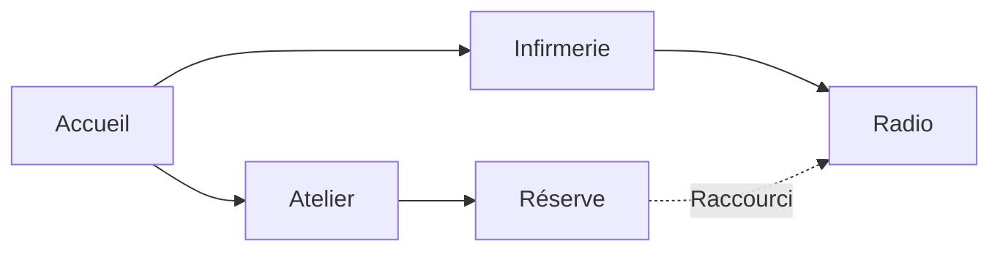
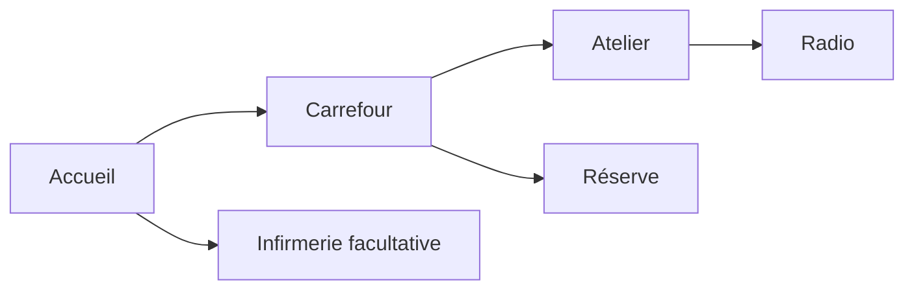
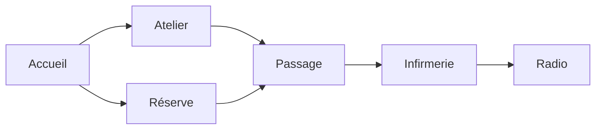

# Le Relais : variations qui changent la partie

William demande le 2026-10-09 davantage de variété roguelike. Les quatre
réflexions du prototype ne suffisent pas : elles conservent le graphe des
pièces et la répartition des achats. La prochaine version doit varier les
choix de parcours et de défense, en conservant les apparitions extérieures.

## Cible retenue

5–8 pièces par partie à partir de 12–16 modules dessinés dans LDtk.
Garantir l'accueil et la radio, puis tirer 3–6 pièces parmi les ateliers,
infirmeries, réserves et salles de passage. Construire un graphe connecté,
avec deux possibilités d'expansion depuis le départ et 0–2 boucles à ouvrir.
La radio est à 2–4 portes du départ. Une branche facultative offre un achat
utile ; les équipements ne doivent pas toujours être accessibles dans le
même ordre. Les relais restent un objectif futur tant que leurs interactions
ne sont pas implémentées.

| Variable | Effet attendu sur les décisions |
| --- | --- |
| Nombre et taille des pièces | Surface de repli et nombre de fenêtres à couvrir |
| Pièces sélectionnées | Équipement disponible dans la partie |
| Connexions et portes | Ordre d'ouverture, détour, raccourci |
| Fenêtres exposées | Angles de défense et approche des zombies |
| Achats et emplacements | Arme ou perk prioritaire, trajet pour se ravitailler |
| Obstacles et passages | Poste de tir, mouvement et solution de fuite |

## Trois parcours réellement différents

Ces graphes sont des propositions de design, pas des résultats du générateur.
L'enveloppe et les couloirs doivent les rendre physiquement réalisables.

Une bifurcation : choisir une arme par l'atelier ou de la survie par
l'infirmerie ; les deux chemins convergent quand le raccourci est acheté.

Un carrefour : plusieurs achats accessibles après une porte commune ;
aller chercher le soda exige un détour distinct. L'ordre des dépenses change.

Deux accès à une même aile : ouvrir le second passage crée une boucle
pour se replier ; la survie et l'objectif sont plus loin que les armes.

## Contraintes physiques

Les spawners restent dehors, avec dégagement pour leur offset et leur corps.
L'extérieur reste connecté autour du bâtiment. Chaque spawner doit pouvoir
rejoindre une fenêtre de l'accueil même avec toutes les portes fermées.
Les fenêtres des autres pièces deviennent utiles à mesure que les portes
ouvrent de nouveaux chemins. Réserver des passages de 48 px ou plus pour
la circulation principale et des étranglements courts aux portes.

Le petit bâtiment constitue une seule carte de combat. On peut composer ses
pièces avant de produire le niveau LDtk final, comme pour la génération de
cavernes. Le contrat d'assemblage et de chargement doit être compatible avec
M2 ; le prompt de cette branche exclut les changements concurrents à son
moteur de salles et d'objets. Une banque de bâtiments différents est une
étape de contenu possible, mais ne démontre pas l'assemblage à chaque partie.

## Vérifier la variété

Sur 200 graines, comparer les graphes avec rôles et distances au départ,
en ignorant translation et réflexion. Cible initiale : au moins 80 signatures
fonctionnelles distinctes ; mesurer aussi les répétitions de chemin vers la
radio, le premier achat possible et le nombre de boucles. La cible de 80 est dépassée : 184 signatures fonctionnelles sur 200 graines
avec les quatorze modules implémentés. Vérifier que les sorties restent accessibles et que
le coût d'un parcours laisse assez de points pour les achats nécessaires.

Rejouer au moins 20 graines jusqu'à V5 avec les bots, en relevant aussi la
stagnation des kills : la graine 11 du prototype termine, mais sa V3 dure
12754 frames, ce qui exige une vérification de fluidité plus forte que
« atteint V5 ». Faire comparer trois parties à William pour valider que
le plan change sa stratégie.

La partie normale conserve actuellement une graine fixe. La sélection d'une
nouvelle graine par partie, son affichage et son enregistrement devront être
traités avec la nouvelle génération ; les replays et tests gardent leur
seed explicite et tous les clients d'une partie utilisent le même seed.

## Implémentation du 2026-10-09

William choisit l'assemblage des pièces. `building_role` est un champ de niveau
LDtk consommé par un générateur dédié, avant la simulation. Quatorze modules
12 × 10 tuiles forment un bâtiment de cinq à huit pièces dans une grille 3 × 3.
Un arbre de portes garantit la connexion ; zéro à deux arêtes supplémentaires
créent des boucles. Le choix des salles et des équipements est sans répétition
de module. Les dimensions des modules sont fixes dans cette première version.

La nouvelle voie est activée uniquement par ce champ : elle ne modifie pas le
générateur Basic, les contrats M2 de salles/objets ni le RNG global. Le résultat
est un niveau LDtk unique, avec les portes et fenêtres existantes. Les defs
et achats viennent des modules ; le cache de sol SunnyLand reste provisoire.

Trois tests passent : graphe et diversité sur 200 graines, reproductibilité,
accès des huit spawners extérieurs malgré les portes fermées, rejet des modules
sans rôles requis ou de mauvaises dimensions. Le scénario historique
`bots_four_mixed` conserve sa trace ; le test de replay associé passe également.
Le binaire avec rendu compile. Voir `docs/captures/le-relais/README.md` pour
les trois cartes générées et le diagramme des plans.

Une graine locale est tirée hors simulation à chaque nouvelle partie, affichée
dans le titre et capturée par les enregistrements. `--seed` accepte aussi les
graines négatives pour reproduire toute graine tirée. En ligne, la graine reste
celle du manifeste, sans nouvelle négociation réseau dans cette branche.

Les vingt essais de combat atteignent V5, sans mort/mise à terre/desync/failure :
175 dégâts, médiane f7197,5, maximum f7709. Le plus long combat d'une vague
mesuré du premier spawn à sa fin dure 1434 frames (23,9 s). Le manifeste démarre
désormais sur les modules du Relais. Validation humaine sur plusieurs plans
encore attendue ; tests de réseau et combat au-delà de l'entrée en V5 non faits.

## Correction après le retour de William

La première composition a été refusée en jeu : modules trop petits, achats
mal placés/chevauchés, sources actives sans joueur dans la pièce. Les modules
sont désormais 24 × 20 tuiles (384 × 320 px), avec station (7,2), réservée sur
48 × 48 px et écartée des portes. Les repères techniques de départ/spawn et le
sprite en double de WeaponLocation ne sont plus visibles. Le sprite SodaLocation
est conservé : c'est le seul rendu de la machine à perk actuelle.

Un binding de quatre entiers LDtk associe chaque source dehors à une zone de
pièce ; la sélection des vagues ne retient que les zones occupées. Le secours de
proximité s'applique quand tout le groupe est dehors. Ce binding reste séparé des
contrats M2 ; pas de nouvelle ressource rollback. Le champ statique est cloné et
hashé dans EnemySpawnerComponent, avec checksum historique conservé si absent.
Les trois tests de génération et quatre de sélection passent, ainsi que la trace
historique bots_four_mixed et le replay sans bless. La variété reste de 184 plans
sur 200 graines. Les dimensions, diagrammes et exports LDtk sont mis à jour.

## Limite d'architecture explicitée à William

Les niveaux LDtk sont aujourd'hui des modules d'auteur ; le générateur les
fusionne en un niveau au chargement. Cela ne conserve pas un LevelId/RoomBounds
par pièce et ne correspond pas encore au découpage de salles prévu par le moteur.
La migration doit garder les niveaux placés par le graphe, leurs connecteurs
appariés et les sources associées, avec un extérieur sans bounds recouvrant les
pièces. Les connecteurs sans voisin doivent être fermés visuellement.

La porte extérieure de l'accueil est supprimée dans la passe immédiate : mur
plein à sa place. Toute porte restante relie deux pièces du graphe. Le contrôle
sur 200 graines vérifie aussi qu'ouvrir toutes les portes ne permet pas au joueur
de rejoindre l'extérieur (fenêtres bloquantes), tandis que les zombies continuent
d'atteindre l'accueil. Le runtime reste un niveau unique ; migration non réalisée.
