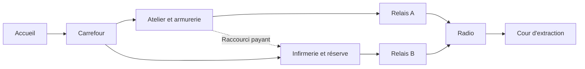

# Démo zombies : conception d'une carte procédurale

Étude du 2026-10-09 avec William. Proposition de conception, pas une carte implémentée.
William valide S5 B, puis donne priorité à S2/S8 : plusieurs salles intéressantes,
un but et une expérience différente à chaque partie. Les valeurs ci-dessous sont
des hypothèses de prototype à éprouver en jeu.

## Ce que fait le dépôt aujourd'hui

LDtk 1.5.3 sert à dessiner les gabarits ; le moteur choisit et assemble leurs copies.
Un niveau LDtk correspond à une salle, sur une grille de 16 px. `Walls` définit les
collisions, `LevelConnection` les passages sur les bords, `Entities` les placements.
Le champ de niveau `spawn` désigne les gabarits de départ. La disposition des niveaux
dans l'éditeur n'est pas le plan de la partie générée.

Deux passages sont compatibles si leurs côtés sont opposés, leur largeur et leur
position sur le bord identiques (`Connection::are_matching`). Le mode `Basic`
place un départ puis ajoute des salles ; un chevauchement ou une sortie des limites
ferme la connexion tentée. Il ne cherche pas un autre candidat pour cette tentative.
`max_room` vaut 10 par défaut : c'est un plafond, pas un nombre garanti.
L'algorithme ajoute une salle à un parent ; il n'a pas d'étape reliant deux salles
déjà placées. On ne peut donc pas compter sur des boucles entre salles générées.
Les gabarits de départ peuvent être réutilisés ensuite (dette D10 connue).

La partie normale utilise `default_seed: 123456` dans `game.ron`. Relancer le
programme avec cette configuration reproduit sa carte. La variété exige aussi
une graine de partie renouvelée, conservée dans l'enregistrement et partagée entre
clients ; les tests doivent garder leurs graines explicites.

Inventaire JSON de `maps/avant_poste.ldtk` effectué pendant cette étude :

| Gabarit | Taille en px | ZombieSpawn | Fenêtres | Récompense utile |
| --- | --- | ---: | ---: | --- |
| Depart | 416 × 304 | 5 | 2 | Une arme murale |
| Couloir | 416 × 304 | 0 | 0 | Une arme murale |
| Cuisine | 416 × 304 | 0 | 0 | CrateLocation non fonctionnelle |
| Chambre | 416 × 304 | 0 | 0 | CrateLocation non fonctionnelle |
| Poste | 416 × 304 | 0 | 4 | CrateLocation non fonctionnelle |
| Jug | 416 × 304 | 0 | 0 | Un soda |
| Armurerie | 416 × 304 | 0 | 0 | Deux armes murales |
| Cave | 416 × 304 | 0 | 0 | CrateLocation non fonctionnelle |
| Cellier | 416 × 304 | 0 | 0 | Un soda |

Correction après essai du prototype : le système ordinaire
`character/enemy/spawning.rs` filtre ses candidats par salle, **mais le mode
vagues appelle son propre sélecteur dans `waves/systems.rs`**, qui ne filtre que
par distance. Ajouter des spawners derrière des portes fermées peut donc faire
apparaître des zombies inaccessibles et bloquer la première vague. La première
lecture avait confondu les deux chemins. La sélection du mode vagues doit être
corrigée avant de valider la démo avec plusieurs salles de combat.
Les fenêtres laissent tirer au travers ; une fenêtre cassée laisse passer les
ennemis, mais bloque encore les joueurs.

Les prix des portes générées sont recalculés : `750 + 250 × profondeur`, et
`electrify` est dérivé de la profondeur. Modifier seulement `price` dans LDtk ne
donne pas le contrôle attendu sur l'économie du parcours. Les armes murales et
sodas sont fonctionnels ; `CrateLocation` ne l'est pas. Aucun terminal d'objectif
ou générateur électrique jouable n'est établi par cette lecture.

Sources locales : `docs/conventions.md` §1 ; `crates/map/src/generation/context.rs`,
`imp/basic.rs`, `mod.rs` ; `crates/map_ldtk/src/generation/from.rs`, `to.rs`,
`game/local.rs` ; `crates/game/src/character/enemy/spawning.rs` ; manifeste zombies.
Lecture et inventaire statique seulement : pas de nouvelle campagne de graines ici.

## Ce qu'on retient de Call of Duty Zombies

La présentation officielle de Terminus décrit la concurrence entre dépenses pour
ouvrir des chemins et dépenses pour améliorer son équipement. Elle mentionne
aussi des espaces de manœuvre pour rassembler les hordes, une quête principale
et une extraction. Ce sont des fonctions à adapter au jeu 2D.

Interprétation de design pour Alacod : chaque ouverture doit changer une décision.
Une salle peut offrir de l'espace, un achat, un raccourci ou une avancée vers le but.
Des voies de fuite lisibles permettent au joueur de comprendre pourquoi il meurt.
La quête donne une raison de quitter un endroit confortable et de prendre un risque.

Références consultées :

- [Treyarch : Terminus, économie, parcours, quête et extraction](https://www.callofduty.com/blog/2024/08/call-of-duty-black-ops-6-zombies-deep-dive-terminus-map-intel).
- [Présentation officielle de Liberty Falls et de ses quêtes](https://www.callofduty.com/au/en/blog/2024/08/call-of-duty-next-black-ops-6-reveal-zombies-liberty-falls-showcase-intel).
- [LDtk : mondes et niveaux](https://ldtk.io/docs/general/world/).

## Proposition : Le Relais

Un poste de communication abandonné. L'équipe veut remettre la radio en service
et évacuer. Cible initiale : une partie de 10–15 minutes, 1–4 joueurs, 8–10 salles
assemblées à partir de 12–16 gabarits. Ce sont des objectifs de conception, pas des
durées mesurées ni des garanties du générateur actuel.

Parcours envisagé : démarrer dans l'accueil, choisir entre deux ailes, atteindre
deux relais de courant, rejoindre la radio puis tenir la cour d'extraction 60 s.
Les relais sont activables dans n'importe quel ordre. Le joueur voit dès le départ
le but « Rétablir 2 relais → appeler les secours → tenir la cour ».

Schéma de conception : les convergences et le raccourci ne sont pas garantis par
`Basic`. Les zones fonctionnelles restent présentes ; les salles intermédiaires,
l'orientation des ailes et certains emplacements de récompenses varient.

| Salle | Décision de jeu | Géométrie proposée | Risque / récompense |
| --- | --- | --- | --- |
| Accueil | Apprendre à défendre puis partir | Zone centrale libre, 2 sorties, 2–3 entrées ennemies | Arme accessible et pression S5 B |
| Carrefour | Choisir la prochaine dépense | Repère central, 3 sorties, visibilité des directions | Distribution vers les deux ailes |
| Atelier | Tenir ou traverser | Établi central contournable, 2 issues opposées | Arme forte, approche ennemie sur deux côtés |
| Infirmerie | Acheter de la survie | Deux chemins autour d'une cloison | Soda, détour plus long mais plus mobile |
| Réserve | S'engager pour une récompense | Petite poche avec retour visible | Achat facultatif, coût du cul-de-sac |
| Relais A/B | Progresser sous pression | Petite arène avec deux issues, terminal visible | Activation, pression accrue à tester |
| Radio | Achever le parcours | Entrées lisibles, obstacle central bas dans la composition | Appel des secours après les deux relais |
| Cour | Se déplacer pour survivre | Grande boucle autour d'un obstacle, 3–4 entrées ennemies | Défense finale puis victoire |

Les obstacles de décor doivent être lisibles comme solides. Une longue ligne de
tir ne doit pas permettre de couvrir toutes les entrées. Les passages de circulation
principaux visent au moins 3 cellules (48 px) pour les corps de 20 px ; les portes
existantes de 32 px restent des étranglements volontairement courts.
Les variantes d'une salle doivent changer couverture, trajet ou entrées ennemies.
Chaque salle dispose d'un repère visuel et d'une silhouette reconnaissables.

## Où placer l'aléatoire

1. Construire le graphe fonctionnel avec départ, deux relais, radio et cour garantis.
2. Choisir les gabarits compatibles avec chaque rôle et les placer sans chevauchement.
3. Ajouter 1–2 branches facultatives et au moins un raccourci formant une boucle.
4. Choisir des variantes d'obstacles et de récompenses dans des emplacements validés.
5. Vérifier accès aux objectifs, navigation, activation des spawners et économie.

Un même seed doit reproduire salles, placements et objectifs. Deux graines devraient
modifier au moins deux décisions parmi route, achat prioritaire, espace de défense
et chemin de retour. Déplacer la carte entière n'est pas une diversité utile.
Limiter les répétitions d'un gabarit nommé ; garantir un départ unique et les achats
essentiels. Après un échec de placement, réessayer selon une procédure bornée et
déterministe ; utiliser une carte de secours valide si aucune tentative ne convient.

L'économie doit être simulée avec S5 B : 60 points par kill, 10 par hit et par
réparation aujourd'hui. Les dégâts par tir et les choix de dépense affectent le
moment où une porte devient abordable ; le nombre de kills seul ne suffit pas.
Cible à tester : premier choix de route vers V2–V3, premier relais vers V4–V5.
Ne pas figer les prix avant une mesure solo et coop sur les parcours retenus.

## Étapes proposées

**Prototype de salles** : produire une nouvelle carte LDtk de travail avec accueil,
carrefour, atelier, infirmerie et cour ; variantes, fenêtres et spawners dans toutes
les salles de combat. Tester la circulation et le ressenti avec les mécanismes
actuels. Les objectifs restent explicitement une maquette tant qu'ils n'existent pas.

**Assemblage guidé** : définir rôles, contraintes, unicité, boucles et contrôle des
prix à partir des interfaces de M2 lorsque disponibles. Le prompt de branche
interdit de toucher au moteur des salles/objets M2 ; cette étude n'y apporte aucun
changement et ne crée pas un générateur concurrent.

**Objectif jouable** : deux relais, dépendance de la radio, défense finale, HUD de
progression, victoire et enregistrement. Réutiliser les mécanismes moteur disponibles
après vérification de M2 ; ne pas inventer des champs LDtk que le loader ignorerait.

**Validation de la démo** : audit statique de 200 graines (objectifs présents,
connectivité, répétitions, boucles, variété des plans), puis au moins 20 graines
jouées par bots avec objectifs adaptés, synctest et invariants. Comparer trois
graines à la main avec William. Cible : 0 carte inaccessible, 0 soft-lock, 0 desync ;
mesurer temps d'accès, portes achetées, dégâts et durée de partie. Les bots acheteurs
actuels ne prouvent pas à eux seuls qu'une quête est terminable.

Prochaine décision de design : privilégier ce complexe de communication, ou garder
le thème domestique de l'avant-poste et lui donner le même parcours d'évacuation.

## Premier prototype construit

Les cinq gabarits sont dans `maps/le_relais_prototype.ldtk`, avec une vue des
plans et les résultats dans `docs/captures/le-relais/README.md`. Le manifeste
garde avant_poste. Génération native sur 20 graines : 10 salles à chaque fois,
20 plans distincts hors translation, aucun chevauchement. Le pilote révèle le
problème de sélection des spawners du mode vagues décrit ci-dessus ; la série
de combat sur 20 graines n'est pas validée. Aucun code moteur modifié.

## Direction choisie : sécuriser un petit bâtiment

William corrige la direction le 2026-10-09 : les zombies doivent venir de dehors
et l'équipe défendre l'intérieur d'un bâtiment compact. Il approuve cinq pièces
avec fenêtres barricadées, portes et sortie tardive dans la cour.

Le prototype est remplacé par quatre orientations d'un même bâtiment de cinq
pièces. Les huit spawners sont tous à l'extérieur, dans une bande continue qui
leur permet de rejoindre les fenêtres de l'accueil même portes fermées. Pièces
et cour sont dans un seul niveau LDtk ; le générateur choisit un plan complet.
Cette disposition vérifie la boucle de défense avant l'assemblage procédural des
pièces. Le pilote atteint V5 (7236 frames, 27 kills, 15 dégâts, aucune mort ni
failure ni desync). Résultats à jour et aperçu : `docs/captures/le-relais/README.md`.
Le sélecteur de vagues n'a pas été modifié : la topologie extérieure résout le
blocage du premier prototype. Les objectifs interactifs et une variété stratégique
plus forte restent à implémenter.

Campagne complète du bâtiment : 20/20 graines à quatre acheteurs atteignent V5,
0 mort/mise à terre/desync/failure, 134 dégâts cumulés. Entrée V5 médiane f6940.
La graine 11 atteint V5 à f18713 après une V3 de 12754 frames : ce retard de
navigation mérite une revue humaine. Le ressenti de ce nouveau bâtiment n’est
pas encore validé. Le manifeste conserve avant_poste et la graine fixe.
