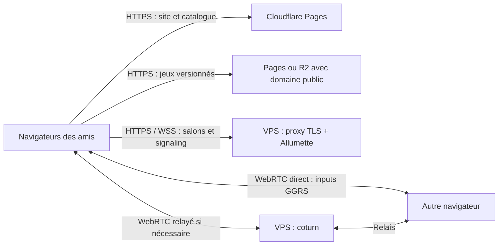

# Site public Alacod et bêta des clones

Date : 2026-10-09. Bases étudiées : Alacod `8a9eb2e` (worktree `deployment`) et
Allumette `b6d0178` (`/Users/william.quintal/Project/bascanada/allumette`, arbre propre).
Statut : **plan de réalisation avec première tranche implémentée localement**.
William a autorisé la poursuite autonome après le plan. Le site et les deux clones ont
été lancés en solo dans Chrome local. Aucune infrastructure créée ni publication effectuée.
Voir le journal de reprise pour distinguer les réalisations des travaux encore prévus.

## Objectif

Faire du site public la porte d'entrée de l'engine : expliquer ce qui fonctionne aujourd'hui,
montrer sa direction et permettre à des amis de lancer les clones dans leur navigateur,
seuls ou ensemble, sans compiler Rust ni configurer un serveur.

Cible initiale : une petite bêta sur invitation, sur ordinateurs avec clavier et souris,
d'abord à deux joueurs, puis à quatre après validation. Conserver le site Svelte existant et
Cloudflare pour la distribution du site et des jeux; ajouter un petit VPS pour les services de
session et le relais réseau. Les invitations désignent des salons privés; elles ne constituent
pas automatiquement un contrôle d'accès à toute la bêta.

## 1. Situation observée

### Engine et clones

Les plans de l'orchestrateur sont présents dans [plan-engine.md](plan-engine.md),
[taches.md](taches.md) et le [brouillon M2](taches/m2-plan-brouillon.md).
Pour décrire l'état actuel, privilégier les rapports récents au tableau initial du plan :
plusieurs cases de ce tableau décrivent encore les manques d'avant M0/M1.

| Sujet | Preuves dans le dépôt | Ce que le site peut annoncer |
|---|---|---|
| Engine modulaire Rust/Bevy, contenu RON | `crates/content`, `sim_core`, `combat`, `effects`, `behaviors`, `world`, `run`; manifestes des jeux | Un moteur 2D où le contenu assemble des systèmes réutilisables |
| `zombies`, M0 | `games/zombies`, rapports M0 : vagues, monnaie, achats, perks, power-ups, à terre/réanimation, HUD | Un prototype de survie coopérative à tester; disponibilité web à valider |
| `throne`, M1 | `games/throne`, [digest M1](digests/m1-fin-de-vague-2.md) : cavernes, étages, projectiles, mutations, HUD, feedback | Un prototype roguelike à étages; revue humaine et disponibilité web à vérifier |
| `gungeon`, M2 | Brouillon détaillé et contrats; aucun dossier `games/gungeon` dans cette base | Prochain chantier, sans bouton Jouer |
| 1837 | Vision et trajectoire de l'engine | Projet visé par le moteur, sans le présenter comme une démo disponible |
| Déterminisme et tests | Scénarios, traces, synctest, bots et benchmarks | Un développement vérifié par des parties reproductibles |

Le digest M1 rapporte, sur `ed8a274`, 198/200 runs terminées à deux bots et 200/200 à quatre,
sans desync ni soft-lock. Ces résultats sont **headless**, sur une version précise : ils ne
prouvent ni les performances navigateur ni la qualité d'une connexion Internet réelle.
Ne pas déclarer M1 entièrement clos sans vérifier sa revue humaine.

### Site et déploiement

- `website/` : SvelteKit/Svelte 5, adaptateur statique; routes accueil, jeux, play, online,
  paramètres et blog déjà présentes.
- L'accueil présente surtout l'ancienne description de l'engine et 1837.
  `DevProgress.svelte` calcule un pourcentage depuis les numéros de version : à remplacer
  par des jalons explicites avec date et état.
- `applications.json` propose `map_explorer` et `character_tester`, pas les clones nommés.
  Le Makefile compile déjà `zombies` sous l'ancien nom **`map_explorer`**.
- `cp_asset` copie uniquement les assets de zombies dans un dossier commun par version.
  Aucun build web de throne dans ce pipeline.
- `.github/workflows/main.yaml` et `release.yaml` construisent une image du site, en
  extraient les fichiers et publient sur Cloudflare Pages, projet `alacod`.
  Vérifier les événements/branches et les environnements avant de distinguer preview et production.
- L'URL publique référencée est `https://alacod.bascanada.org`. Son accès par l'outil web
  a échoué pendant l'étude; cela ne prouve pas une panne. État réel de Pages/DNS et dernière
  version servie à contrôler au démarrage, avec navigateur et accès aux comptes.

### Réseau Alacod : deux chemins à réconcilier

- Le jeu utilise GGRS + WebRTC/Matchbox. Le site intègre `@bascanada/allumette-web`.
- Le client HTTP Allumette récent (`challenge/login`, salon, ICE) dans le jeu est
  **natif uniquement**. `args/mod.rs` laisse `allumette` vide en wasm.
- `/online` transmet un token comme lobby; `/play`, `loader.js` et les attributs du canvas
  forment le pont actuel vers le jeu. Leur compatibilité avec le serveur actuel reste à prouver.
- Le navigateur utilise les STUN Google par défaut dans `jjrs/p2p.rs`; il faut lui donner
  un chemin explicite vers la configuration ICE/TURN.
- [Jouer à deux](jouer-a-deux.md) rapporte au 2026-10-04 un signaling testé via IP Tailscale,
  mais pas deux machines sur des réseaux Internet distincts. Cette note rapporte également
  l'ancien endpoint `allumette.bascanada.org` sans résolution DNS : à revérifier, pas à réutiliser aveuglément.
- Le restart P2P direct existe; le module `restart.rs` précise que le chemin Allumette n'est
  pas couvert en v1. La bêta doit vérifier son propre chemin de relance.

### Allumette : constat après lecture du dépôt ajouté

Le code confirme une **stack indépendante, multijeu**, avec serveur Rust `0.11.0` et
bibliothèque Svelte `@bascanada/allumette-web` `0.0.10`. Le site Alacod déclare `^0.0.9` :
avec cette contrainte, la version `0.0.10` doit être adoptée explicitement et vérifiée dans
le lockfile. Aucun test ni serveur n’a été exécuté pour cette étude; la présence de tests
ne signifie pas qu’ils passent dans les conditions de la future bêta.

| Fonction | État constaté dans Allumette | Conséquence pour le plan |
|---|---|---|
| Authentification | Challenge signé Ed25519; JWT utilisateur de 24 h (`src/auth.rs`, `src/lib.rs`) | Réutiliser ce protocole; prévoir expiration et retour au salon |
| API + signaling | Un serveur sur `3536`; routes HTTP fusionnées avec le serveur Matchbox; WebSocket sur `/<JWT>` | Un seul processus Allumette derrière le proxy, sans second serveur Matchbox |
| Salons | `game_id`, propriétaire, joueurs, visibilité, whitelist, états Waiting/InProgress | Ajouter capacité, compatibilité de build, prêt/démarrage et contexte de session génériques |
| Invitation privée | `/invite` ajoute des **clés publiques** à une whitelist | Un simple lien ne permet pas encore d’admettre un nouvel ami inconnu |
| Mises à jour | `/lobbies/stream`, SSE consommé par fetch avec Bearer | Proxy sans buffering et client capable de resynchroniser après coupure |
| ICE | `/ice-servers` authentifié; STUN puis TURN temporaire HMAC-SHA1, TTL 24 h | Coturn et Allumette partagent TURN_SECRET; aucun nouveau service d’émission nécessaire |
| UI web | Auth, amis, création/liste; callback de lancement incluant `iceServersJson` | Réutiliser le service et adapter les composants au parcours Alacod |
| Cycle de vie | Connexion du propriétaire ⇒ InProgress; dernier socket fermé ⇒ Waiting; adhésions conservées | Fixer explicitement les participants avant connexion, et une barrière de fin avant relance |
| Persistance | Salons et présence en mémoire; cleanup des salons Waiting inactifs après 15 min | Une seule instance initiale; un redémarrage efface les salons, retour utilisateur expliqué |

### Frontière décidée : Allumette reste indépendante d’Alacod

Allumette doit pouvoir servir d’autres jeux et d’autres moteurs. Elle possède son API,
son protocole de signaling, son SDK/UI et sa livraison; elle ne dépend d’aucune crate
Alacod, de GGRS, de RON ni du catalogue éditorial du site. Le protocole Matchbox transporte
la négociation WebRTC, puis les clients échangent leurs données de jeu directement ou via
coturn. Coturn est un service de la stack Allumette; il ne simule pas le gameplay.

Les identifiants de jeu et de compatibilité sont des chaînes opaques pour Allumette.
Les nombres de joueurs, invitations, readiness et tours de session sont des concepts
réutilisables. Alacod fournit son adaptateur et choisit ses règles de gameplay, sa graine,
ses inputs et son rollback. La même identité Allumette peut servir à plusieurs jeux;
le serveur actuel limite toutefois une identité à **un salon actif à la fois**.

## 2. Site proposé

Un style cohérent avec les captures des jeux, des textes courts et une navigation simple.
Langue de départ proposée : français; traduction anglaise ensuite si utile.

| Page | Contenu et comportement |
|---|---|
| `/` | Présentation courte, état daté de l'engine, accès aux jeux, direction vers 1837 |
| `/engine` | Architecture en termes accessibles, capacités actuelles, objectifs et limites connues |
| `/games` | Cartes zombies/throne : capture, type de jeu, état, joueurs validés, version, Solo/En ligne |
| `/games/<id>` | Description, contrôles, limites, notes de version et actions de lancement |
| `/play` | Chargeur commun : progression, erreur compréhensible, plein écran, version, sortie |
| `/online` | Créer/rejoindre un salon privé, pseudonyme, taille, invitation, joueurs présents |
| `/beta` | Guide de test, problèmes connus, rapport de bug avec contexte reproductible |
| `/roadmap` | M0/M1/M2 et suite : disponible, en validation, en développement, envisagé |

Conserver les routes existantes utiles et prévoir une redirection ou une explication pour
les anciens liens `map_explorer`. Le testbed reste un outil de développement.
Les noms et descriptions des clones doivent les présenter comme des prototypes inspirés
par les références; les assets publiés doivent être recensés dans leurs `assets.yaml`.

Créer une source de données du catalogue, partagée par cartes, lancement et salons :
`id`, titre, description, statut, modes validés, nombre de joueurs, contrôles, captures,
`buildId`, URL du manifeste de build et problèmes connus. Séparer le texte éditorial de la
liste des artefacts réellement publiés : un jeu sans build valide n'offre pas de lancement.

## 3. Architecture cible

Le VPS ne simule pas les parties. Il permet aux joueurs de se rencontrer et relaie les
paquets lorsque la liaison directe échoue. Le P2P nécessite donc des services accessibles.

### Cloudflare

Conserver Pages pour le site statique. Produire un artefact immuable par **jeu et build** :
par exemple `/builds/<buildId>/<gameId>/{wasm.js,wasm_bg.wasm,assets/,build.json}`.
Le manifeste doit identifier engine, contenu et protocole, plus les empreintes des fichiers.

Mesurer les artefacts avant de choisir leur stockage : Pages limite un fichier à **25 MiB**;
Cloudflare recommande R2 pour les fichiers plus gros. Si un WASM dépasse cette taille,
utiliser R2 avec un domaine d'assets et les règles CORS/MIME nécessaires.
[Documentation des limites Pages](https://developers.cloudflare.com/pages/platform/limits/).

Mettre en cache longtemps les builds immuables et revalider le catalogue qui choisit la
version active. Le service worker actuel précharge tout `static` et cache les GET :
éviter le téléchargement de tous les clones à l'installation, les anciens catalogues et le
cache des API de salon/ICE. Vérifier aussi l'expérience après une mise à jour et un rollback.

### Petit VPS

Point de départ de dimensionnement, à mesurer : **2 vCPU, 2 Go de RAM**, Linux,
proche des participants, IP publique stable et transfert inclus suffisant. Ce n'est pas
un choix de fournisseur ni une estimation tarifaire. Le trafic TURN sera le principal
poste variable; mesurer le débit relayé par joueur et le multiplier par joueurs/heures.

Services proposés :

1. Proxy TLS (Caddy ou équivalent), devant les API HTTP et le signaling WebSocket.
2. Un serveur Allumette pour l’authentification, les salons, SSE et le signaling Matchbox
   intégré, sur son port interne `3536`. Son API reste utilisable par d’autres jeux.
3. coturn : relais TURN avec credentials temporaires émis côté serveur, quotas et
   plage de ports de relais explicitement configurée.
4. Supervision légère : santé des services, erreurs, connexions, trafic TURN, disque.

Domaines décidés par William : **`alacod.estran.studio`** pour le site et
**`allumette.estran.studio`** pour l’API et le signaling, dans la zone `estran.studio`.
Pour TURN, proposer `turn.estran.studio` (à confirmer), avec un enregistrement distinct
pour permettre le mode DNS-only. L’API/WSS peut passer par le proxy Cloudflare;
prévoir les coupures/reconnexions WebSocket.
[Documentation WebSocket Cloudflare](https://developers.cloudflare.com/network/websockets/).
TURN doit être joignable directement, en DNS-only dans cette architecture. Configurer les
ports d'écoute UDP/TCP et TLS retenus ainsi que la plage de relais et l'IP annoncée.
Si TURN/TLS doit écouter sur 443 pour les réseaux restrictifs, résoudre sa cohabitation avec
le proxy HTTPS (port alternatif validé, seconde IP ou routage adapté).

Conserver secrets, données persistantes et sauvegardes hors des images; figer les versions
Docker; redémarrage automatique, rotation des logs, pare-feu et recette de restauration.
Reporter OpenObserve si inutile pour les premières soirées. Le compose actuel contient
une configuration locale avec credentials de démonstration, pas une base de production.
[Projet et configuration coturn](https://github.com/coturn/coturn).

## 4. Contrats indispensables pour jouer

### Portage des clones vers le navigateur

**Risque prioritaire** : les deux `main.rs` appellent `content::load_and_lint` depuis un
`PathBuf` construit avec `CARGO_MANIFEST_DIR`, et passent un chemin absolu d'assets.
Un dossier de compilation n'est pas un système de fichiers disponible dans le navigateur.
Compiler du WASM ne suffit pas : prouver le chargement du manifeste, des RON, cartes,
textures et sons par un chemin web ou un registre embarqué, sans dépendance à la machine du build.

Conserver la validation native du contenu dans la CI; choisir un contrat web de chargement
(assets asynchrones ou contenu prévalidé embarqué), avec une racine relative propre à chaque
jeu. Documenter l'impact sur l'engine et protéger les scénarios natifs existants.

Le chargeur commun doit valider les IDs/versions, construire les URLs avec `URLSearchParams`,
charger uniquement le jeu sélectionné, afficher les erreurs de téléchargement/initialisation,
gérer le focus du canvas et l'activation audio. `loader.js` cherche actuellement un tag
`bevy-canvas` via `getElementsByTagName`, alors que le canvas est désigné par son ID.

### Salons, compatibilité et ICE

Le salon fixe **jeu + build + protocole + nombre de joueurs**. Les clients incompatibles
sont refusés avant le démarrage; une publication du site ne modifie pas un salon en cours.
Le lien d'invitation contient un identifiant non devinable, pas de secret TURN durable.

Valider la chaîne exacte : création → adhésion → joueurs identifiés et ordonnés → token de
signaling → configuration ICE → connexion → lancement GGRS. Éviter les doubles encodages
JSON/URL et le mélange entre ID de salon, token et chemin WebSocket.

Pour la bêta, utiliser Allumette comme stack commune. Le chemin Matchbox direct peut rester
un outil de diagnostic interne; il ne constitue pas une deuxième architecture de production.

Prévoir : expiration des invitations et salons, départ avant démarrage, attente avec délai,
échec ICE expliqué, retour au salon et relance à deux. Ne pas promettre rejoindre une partie
en cours ni reprendre après déconnexion; ces comportements restent à développer/valider.

### Parcours cible solo

1. Choisir zombies ou throne, cliquer **Jouer solo**.
2. Charger le build et son contenu; initialiser un joueur local, sans URL de signaling,
   sans login, sans salon et sans requête ICE.
3. Jouer, terminer, relancer localement ou retourner au catalogue.

Une panne d’Allumette ne bloque pas le solo. Éviter que l’import global des composants
Allumette ou une session JWT persistante impose des requêtes réseau au parcours solo.
Le mode solo peut fonctionner sans services multijoueurs; le téléchargement initial reste
nécessaire, sans promesse de prise en charge hors ligne dans cette première bêta.

### Parcours cible multijoueur

1. Choisir le jeu puis **Jouer avec des amis**; saisir un pseudonyme. Créer une identité
   Ed25519 locale et signer le challenge, sans imposer wallet ou phrase de récupération
   avant la première partie. La sauvegarde/récupération d’identité et les amis sont optionnels.
   Cette UX simple demande un adaptateur au service existant, pas une nouvelle auth serveur.
2. Créer un salon privé pour un build fixé et 2 ou 4 joueurs. Copier un lien d’invitation.
3. L’ami ouvre le lien, crée/réutilise son identité et accepte l’invitation. Le serveur
   valide le droit d’accès et réserve sa place; le site ne demande pas un échange manuel de clés.
4. Tous chargent le même build et annoncent **Prêt**. Le propriétaire démarre quand le
   nombre attendu est atteint; le serveur fige la liste et la nouvelle session.
5. Chaque client obtient ICE et son ticket de signaling, ouvre le WebSocket puis WebRTC.
   Le jeu démarre quand les pairs attendus sont connectés; sinon timeout et retour au salon.
6. Fin de partie : quitter la session, fermer les sockets, revenir au même salon.
   **Rejouer** crée une nouvelle session lorsque les joueurs sont prêts. Pas de reprise
   automatique d’une simulation après perte d’un peer pour cette première livraison.

### Contrat de lancement et corrections identifiées

Créer un objet de lancement validé, transmis au chargeur par une API JavaScript ou un
`postMessage` vérifié (origine/source). Les paramètres publics peuvent désigner jeu/build/salon;
JWT et credentials TURN ne doivent pas être placés dans une URL de navigation.

| Champ proposé | Propriétaire | Usage |
|---|---|---|
| `gameId`, `buildId`, `compatibilityId` | Catalogue Alacod, valeurs validées par Allumette | Sélection et refus des versions incompatibles |
| `lobbyId`, `sessionId`, `capacity` | Allumette | Isolation du salon et de chaque nouvelle partie |
| `participants`, `localPlayerId` | Allumette | Identités et association stable aux peers |
| `signalingUrl`, ticket court | Allumette | URL WSS exacte, sans suffixe inventé par le jeu |
| `iceServers` | Allumette | URLs STUN/TURN, username et credential temporaires |
| Racine d’assets, réglages et graine | Adaptateur Alacod | Contenu et configuration de la simulation |

Le schéma et les nouveaux endpoints sont des **contrats à implémenter**, pas des API déjà
présentes. Versionner ce contrat dans Allumette et publier des exemples pour un client
indépendant d’Alacod. Tests interop avec les versions Matchbox réellement verrouillées.

Corrections concrètes à inclure dans les lots :

- `LobbyList.svelte` fournit `iceServersJson`, mais `/online` Alacod l’ignore; le canvas
  et `args/web.rs` n’exposent pas ICE. Ajouter le pont complet jusqu’au socket.
- Le code natif prend seulement la **première** entrée ICE; l’API renvoie STUN en premier,
  TURN en second. Examiner la capacité du builder Matchbox et assurer que les URLs TURN
  et leurs credentials sont effectivement utilisés, sur web et natif. Tester en relay forcé;
  ne pas fusionner naïvement des serveurs avec des credentials différents.
- Allumette retourne les joueurs issus d’un `HashSet`; leur ordre ne définit pas les handles.
  Trier les identités et exposer la correspondance identité ↔ PeerId/session dans le protocole.
  Alacod associe actuellement les configs distantes par position dans une liste : la remplacer
  par une correspondance explicite et vérifier les handles identiques sur tous les clients.
- Le callback actuel transmet un **JWT utilisateur**, pas un token de salon. Le serveur
  retrouve l’adhésion via l’identité. Pour l’isolation des sessions, prévoir des tickets
  courts liés à identité/salon/session; le jeu consomme l’URL exacte. Ne jamais ajouter
  `-rN` à un JWT pour relancer : le restart Matchbox historique le ferait invalider.
- La capacité, le build et le statut prêt ne sont pas présents dans `CreateLobbyRequest`.
  Les vérifier côté serveur, y compris joins concurrents et transitions de démarrage.
- L’invitation actuelle par whitelist ne suffit pas pour le lien cible. Ajouter un token
  d’invitation opaque, limité au salon, révocable/expirable, qui autorise l’admission de
  l’identité connectée. Garder la whitelist d’amis existante comme autre mode générique.
- `getIceServers()` retombe silencieusement sur STUN si l’API échoue. Pour la bêta,
  rendre cette dégradation visible et proposer Réessayer; aucune réussite TURN supposée.
- Le client SSE se reconnecte après exception, mais une fin normale du flux sort sans
  reconnexion. Reprendre aussi après EOF, refaire un snapshot et gérer JWT expiré.
- À la suppression d’un salon, le serveur porte un TODO de fermeture des sockets.
  Assurer départ/suppression, double onglet et connexions obsolètes sans pairs fantômes.
- La topologie relaie un `Signal` vers le peer demandé sans contrôle explicite du même salon
  dans cette branche : ajouter l’isolation par salon/session et son test avant la bêta.

### Déploiement indépendant et configuration

Allumette a son image, sa CI, ses versions serveur/SDK et ses tests; Alacod verrouille les
versions qu’il consomme. Les tests Allumette utilisent un petit client protocolaire ou une
fixture multijeu, sans compiler l’engine. Le serveur n’héberge pas les builds des clones.

Variables existantes : `HOST`, `JWT_SECRET`, `TURN_SECRET`, `TURN_URLS`, `STUN_URL`.
En production, refuser l’absence de JWT_SECRET au lieu de garder son fallback de développement.
Coturn reçoit le même secret TURN côté serveur; horloges synchronisées pour les credentials.
Le TTL actuel est 24 h : fixer une durée adaptée aux soirées et une politique de renouvellement.

Configurer origines HTTP autorisées (site et previews explicitement admises), contrôle
Origin des WebSockets et limites de requêtes/connexions. Le CORS actuel est très permissif;
il ne remplace pas les contrôles d’admission. Éviter de journaliser les chemins contenant
les JWT. Le proxy doit laisser passer SSE et WebSockets sans cache, avec santé `/health`.

Le domaine `allumette.estran.studio` sert l’API/signaling. Sa page racine peut proposer plus
tard une présentation de la stack; une UI autonome complète n’est pas nécessaire pour que
le site Alacod intègre le SDK. TURN reste sur un hostname DNS-only séparé.
Mettre à jour les valeurs par défaut du site et migrer ses anciens paramètres persistés;
les identités stockées sous l’ancien domaine ne migrent pas automatiquement vers le nouveau.

### Retours de bêta

Un rapport inclut jeu/build, navigateur/OS, graine si disponible, taille du salon, étape de
l'échec et description; téléchargement des logs avec les tokens retirés. Commencer par un
rapport copiable et un lien vers les issues, sans imposer un compte aux amis.
Si collecte distante : endpoint serveur limité, consentement explicite, rétention courte.
Ne pas exposer les credentials OpenObserve dans les paramètres d'URL ou le client.

## 5. Lots de travail et critères de sortie

Les IDs `WEB-*` évitent la collision avec les tâches M0/M1/M2. Les durées sont indicatives,
à réestimer après WEB-01; le portage WASM est l'inconnue principale.

| Lot | Dépendances | Travail | Critère de sortie |
|---|---|---|---|
| WEB-00 — Contrats et inventaire | Aucune | Vérifier Pages/DNS/CI; formaliser API générique Allumette, launch context, invitation/session et versions; 1–2 jours | Schémas et responsabilités fixés, endpoints existants/nouveaux distingués |
| WEB-01 — Tranche zombies web | WEB-00 | Build du vrai clone, chargement du contenu, assets isolés, chargeur, lancement solo; 2–5 jours indicatifs | Depuis une preview HTTPS, une partie complète et une relance; aucun chemin local ni asset 404 |
| WEB-02 — Site et catalogue | Peut démarrer avec WEB-00 | Accueil, engine, cartes, roadmap factuelle, guide bêta, contrôles; 2–4 jours | Textes validés contre les rapports; lancement proposé uniquement pour les builds vérifiés |
| WEB-03 — VPS reproductible | Contrat serveur de WEB-00 | Compose/proxy/coturn, secrets, DNS/TLS, firewall, santé, sauvegarde; 1–3 jours hors provisionnement | Services redémarrables, HTTPS/WSS valide, allocation TURN authentifiée |
| WEB-04A — Stack Allumette multijeu | WEB-00 | Capacité/build/readiness, invitation par lien, tickets/session, mapping des peers, cycle de vie et isolation; 4–8 jours à réestimer | Tests API/signaling pour deux jeux et plusieurs salons sans dépendance Alacod |
| WEB-04B — Adaptateur Alacod online | WEB-01 + WEB-03 + WEB-04A | SDK verrouillé, identité simplifiée, launch context, ICE, invitation, attente et retour au salon; 3–6 jours | Duo sur réseaux distincts et relay TURN forcé, sans desync; nouvelle partie depuis le même salon |
| WEB-05 — Throne et distribution | WEB-01; online après WEB-04B | Build throne, contenu isolé, captures/contrôles; Pages/R2, previews et promotion | Solo/duo vérifiés pour chaque build publié; rollback conserve les artefacts nécessaires |
| WEB-06 — Soirée pilote | WEB-02 + WEB-04B; throne si validé | Recette ami, matrice navigateurs/réseaux, feedback, corrections | Deux amis rejoignent sans aide technique; rapport de session et blockers fermés |

Ordre recommandé : **WEB-00 → WEB-01**, puis site et VPS, puis duo online,
puis throne et séance pilote. Ne pas attendre M2 pour rendre M0/M1 testables.
Budget indicatif : **15–30 jours de travail**, à réestimer après WEB-00/01, surtout pour
le chargement WASM et le contrat de session Allumette. La première bêta peut ne publier que
zombies; throne suit dès sa recette verte. Aucune date ferme avant ces deux validations.

Fichiers concernés : `website/src`, `website/static/loader.*`, `Makefile`, workflows,
`games/{zombies,throne}/src/main.rs`, `crates/content`, `crates/game/src/{args,jjrs}` et
nouveaux fichiers de déploiement VPS. Côté Allumette : `src/{lib,lobby,state,topology,auth}.rs`,
`allumette_web/src/lib`, tests API/WS et packaging/CI. Une tâche/PR par dépôt modifié, avec
ordre compatible : contrats serveur → SDK → adaptateur Alacod. Coordonner les changements engine/réseau avec
l'orchestrateur avant de toucher les fichiers travaillés pour M2.

## 6. Recette avant d'inviter les amis

- [ ] Site accessible en HTTPS, contenu à jour, métadonnées et liens corrects.
- [ ] Solo jouable lorsque Allumette est indisponible; aucune authentification imposée.
- [ ] Un nouvel ami rejoint avec pseudonyme et lien, sans échange manuel de clés.
- [ ] Tests Allumette avec deux IDs de jeu : aucun peer ni signal ne traverse les salons.
- [ ] Places réservées et compatibilité vérifiées côté serveur, y compris joins simultanés.
- [ ] Ordre/identités des joueurs associés aux mêmes handles sur tous les clients.
- [ ] Une deuxième partie utilise une nouvelle session sans altérer le JWT ni garder de peer fantôme.
- [ ] SSE resynchronisé après EOF/coupure; suppression et double onglet gérés.
- [ ] Redémarrage serveur : salons perdus annoncés et nouveaux salons créables.
- [ ] Zombies solo : chargement neuf, gameplay, audio, contrôles, défaite et relance.
- [ ] Throne solo : étages, portail, mutations, défaite et relance, si proposé au catalogue.
- [ ] Duo sur deux machines et deux réseaux domestiques différents.
- [ ] Duo avec ICE forcé en `relay` : prouver le chemin TURN, pas seulement STUN.
- [ ] Quatre joueurs testés avant d'afficher ce mode comme disponible.
- [ ] Chrome et Firefox desktop validés; Safari évalué et annoncé selon le résultat.
- [ ] Invitation périmée, salon plein, version incompatible, signaling coupé et peer absent :
      message compréhensible, attente bornée et retour possible.
- [ ] Publication pendant une partie : elle continue avec son build; un ancien lien est géré.
- [ ] Cache navigateur/service worker : deuxième visite, mise à jour et retour arrière cohérents.
- [ ] Temps de chargement, taille transférée, FPS et trafic TURN relevés sur une machine ordinaire.
- [ ] `npm run check`, build du site, builds WASM et lint des deux contenus passent.
- [ ] Si code partagé de simulation modifié : scénarios/traces et vérifications de rollback
      appropriés passent sans bénédiction automatique.
- [ ] Rapport de bug utilisable, logs sans credentials, procédure de rollback écrite et exercée.

Le natif via Tailscale peut dépanner une session interne, mais ne remplace pas ces critères
pour une bêta annoncée comme jouable sur le site.

## 7. Décisions à prendre au démarrage

| Décision | Proposition initiale | Quand trancher |
|---|---|---|
| Domaines — décidé | `alacod.estran.studio` (site), `allumette.estran.studio` (API/signaling), zone `estran.studio` | WEB-00/03 : configurer DNS/TLS, origines CORS, URLs client et métadonnées; prévoir les anciens liens |
| Hébergement des jeux | Pages si tailles compatibles, sinon R2 | WEB-01, mesures des artefacts |
| Fournisseur/région/budget VPS | Petit VPS proche des amis, transfert suffisant | WEB-03, selon leur localisation et budget |
| Stack réseau — décidé | Allumette indépendante et multijeu, signaling intégré + coturn; Alacod client | WEB-00 : versionner les extensions génériques; WEB-04A/B : intégrer |
| Accès à la bêta | Site public, salons privés par invitation | Avant WEB-06; ajouter un contrôle d'accès si souhaité |
| Langue | Français d'abord | WEB-02 |
| Navigateurs | Chrome/Firefox desktop d'abord | WEB-01/06, mesures réelles |
| Recueil des retours | Rapport copiable + issues | WEB-02; collecte distante seulement si utile |

### Portée de la validation du plan

Étude réalisée par lecture des sources serveur, SDK et site. Les UI en fonctionnement
ne sont pas nécessaires pour finaliser ce document. Elles serviront lors de l’implémentation
à vérifier les parcours utilisateurs et les connexions WebRTC entre machines. DNS, comptes
Cloudflare, VPS, compilation WASM et comportement réel restent des validations de livraison.

## 8. Journal et procédure de reprise

À chaque reprise : lire ce document, relever le SHA et `git status`, consulter les derniers
digests et la tâche réseau active, puis choisir **un lot** et mettre à jour la ligne suivante.
Les nouveaux résultats doivent porter leur build et leur environnement de test.

| Date | Lot / état | Preuve ou décision | Prochaine action |
|---|---|---|---|
| 2026-10-09 | Domaines décidés | Zone `estran.studio`; site `alacod.estran.studio`; service `allumette.estran.studio` | Appliquer ces noms aux configurations lors de WEB-00/03; TURN reste à confirmer |
| 2026-10-09 | Plan final après étude Allumette; implémentation non commencée | Allumette `b6d0178` : serveur/SDK, ICE, salons, topologie et tests lus; indépendance multijeu confirmée par William | WEB-00 : formaliser les extensions et vérifier production; WEB-01 : spike zombies WASM |

Pour une session courte, commencer par WEB-00 et noter le serveur/version réellement visés.
La première preuve technique à produire ensuite est une URL de preview où **zombies charge
son propre contenu et se joue en solo**. Elle détermine le reste du chantier.

### Reprise après la première tranche locale — 2026-10-09

**Réalisé dans Alacod, modifications non commitées :**

- Site français : accueil, catalogue zombies/throne, moteur, roadmap, guide bêta,
  lanceur solo et page multijoueur indiquant son état de préparation.
- Chargement du contenu des deux clones en WASM : définitions embarquées, ressources
  graphiques servies par jeu et build. Parité de registre vérifiée avec le chargement natif.
- Script `scripts/build-web-games.mjs`, manifestes versionnés et catalogue de releases.
  Il remplace les anciens alias de build. Le pipeline complet du script reste à exercer;
  les étapes compilation, bindgen et optimisation ont été exécutées séparément.
- Deux builds de développement locaux `preview`, jouables via `http://127.0.0.1:4173`.
  `website/static/builds` est ignoré par Git. Le catalogue local pointe vers ces fichiers;
  générer le catalogue de livraison avec les builds avant toute publication.
- Configuration VPS préparée dans `deploy/allumette` : Allumette, Caddy et coturn,
  exemples sans secrets. Syntaxe Compose et shell vérifiée, aucun conteneur déployé.

**Réalisé dans le dépôt indépendant Allumette :** isolation des signaux entre salons,
ordre stable des joueurs, reconnexion SSE du SDK après fermeture du flux. Le contrat
`docs/browser-sessions-v1.md` décrit les extensions génériques à implémenter; il ne
constitue pas une API déjà disponible. Aucun couplage à l’engine ajouté.

**Preuves :** 168 tests content passent, dont deux nouveaux tests de contenu embarqué.
Les 33 tests Allumette existants et les deux nouveaux tests d’isolation passent.
Le site passe la vérification Svelte et la compilation de production. Les sept pages
principales ont été parcourues automatiquement dans Chrome, sans erreur JavaScript,
avec vérification de débordement en desktop et mobile. Les deux clones ont initialisé
leur renderer, chargé leur contenu et exécuté une partie jusqu’à la défaite.
Après R, les captures montrent une nouvelle partie à 100/100 de vie. Le parcours
final ne produit ni erreur JavaScript ni requête HTTP en échec. La compilation
native des deux clones passe également (avertissements existants conservés). Captures
du site dans [captures/site-public](captures/site-public/README.md).

**Limites et prochaine tranche :**

1. Les WASM de développement optimisés restent autour de 97–98 MiB par jeu. Ils
   dépassent la limite Pages : mesurer des builds release puis intégrer R2 si nécessaire.
   Le chargeur actuel sert des chemins locaux de même origine; ne pas supposer que
   le seul ajout d’un bucket rend la distribution opérationnelle.
2. Vérifier humainement les commandes, restart, mutations et passage d’étage, puis
   Firefox et performances sur les ordinateurs des amis. Chrome automatisé utilise
   un renderer logiciel et ne donne pas une mesure de performance utilisateur.
3. WEB-04A : tester explicitement l’interopérabilité Matchbox client 0.15 / serveur 0.13,
   puis implémenter sessions, capacité, readiness et tickets génériques dans Allumette.
4. WEB-04B : intégrer le SDK côté site et fournir toute la liste ICE à l’engine.
   Le multijoueur du nouveau lanceur est volontairement désactivé jusqu’aux preuves
   à deux machines, incluant TURN.
5. Choisir VPS et confirmer `turn.estran.studio`, fournir accès Cloudflare/DNS et
   secrets de déploiement. Aucune modification externe n’a été effectuée.

Reprendre par une livraison solo mesurable (release/R2), puis les tests de compatibilité
réseau. Lire aussi [contrat-lancement-web.md](contrat-lancement-web.md) et les changements
non commités dans les **deux** dépôts avant de lancer une autre tâche.

### Ajustement visuel demandé — 2026-10-09

À la demande de William, retour au thème historique : palette rouge/verte du dépôt,
police Metal Mania, logo original, navigation latérale et accueil en deux colonnes.
La nouvelle identité éditoriale sombre/sauge a été retirée. Les informations moteur,
les clones, le guide bêta et le lanceur solo restent intégrés au thème d’origine.
Le panneau d’avancement décrit M0/M1/M2 et la préparation bêta, sans convertir
les numéros de version en pourcentage de réalisation.

Validation : vérification Svelte et build de production; sept pages dans Chrome,
aucune erreur JavaScript ni débordement horizontal desktop/mobile. Les captures
d’accueil ont été actualisées. Les captures de gameplay précédentes restent des
preuves du lancement solo avant cet ajustement de présentation.

### Intégration Allumette et VPS — 2026-10-09

Les bases ont été commitées sur `main` avant l’intégration : Alacod `6af4e60`,
Allumette `e7e9f06`. La tranche suivante ajoute des salons privés multijeux,
readiness, invitations et tickets de session dans Allumette, un SDK navigateur
indépendant, le parcours à deux joueurs du site et l’adaptateur de lancement WASM.
Ces changements restent en cours de validation et non commités.

Le VPS fourni par William est maintenant provisionné : Docker/Compose, Allumette,
Caddy HTTPS/WSS, coturn, pare-feu et démarrage automatique. Les DNS Allumette et
TURN sont configurés en DNS-only. Voir [configuration et recette VPS](../deploy/allumette/README.md).
HTTPS, auth invitée, CORS, STUN et allocations TURN sont vérifiés. Tests : 40 Rust
Allumette, quatre SDK; compilation native/WASM des deux clones et Svelte passent.

Le data channel WebRTC ne s’établit pas encore entre les deux Chrome automatisés,
même avec TURN; le même environnement échoue sur un test direct sans engine.
Ne pas activer le catalogue public online sur la seule preuve des allocations.
La configuration locale `preview` sert uniquement à la recette. Restent :
isoler le transport, prouver deux parties successives sur deux machines, publier
les builds et le site sur Cloudflare, puis compléter la recette des amis.

### Connexion WebRTC débloquée — 2026-10-09

Le test minimal depuis Chromium 154 sur Debian 13 établit un data channel TURN
et échange un message et un acquittement. Les candidats sélectionnés sont `relay`
des deux côtés; configuration complète, UDP seul et TCP seul passent. La recette
reproductible est dans Allumette : `tools/webrtc-smoke`.

Le Mac échoue également sur un test direct sans engine ni serveur; sa route vers
le VPS passe par un tunnel `utun4` et des requêtes STUN/TURN expirent. Comparer
hors VPN reste nécessaire pour attribuer précisément la cause locale. Aucune
preuve ne justifie d’attribuer cet échec au serveur Allumette.

Le parcours complet fonctionne depuis deux contextes Chromium isolés sur le VPS,
avec le signaling HTTPS/WSS déployé et TURN forcé : **Zombies et Throne**, deux
sessions successives chacun, quelques entrées clavier, retour au salon puis
fermeture du salon. Aucune erreur JavaScript, requête HTTP en échec ou désync
observée. Le mapping identités/PeerId est présent; les deux joueurs apparaissent
dans le jeu. Cette recette démontre l’interopérabilité observée des versions
Matchbox client/serveur, mais ne couvre pas encore deux réseaux distincts.

La recette a révélé un panic Matchbox lors du retour au salon : le socket GGRS
envoyait après fermeture du canal. `BrowserChannel` garde les envois/réceptions
sur le runtime navigateur et demande le retour au salon si le canal est fermé.
Les deux clones ont été reconstruits et le même scénario repasse sans panic.
La compilation native passe également.

Le pipeline `scripts/build-web-games.mjs` a été exécuté de bout en bout pour les
deux clones : lint du contenu, compilation WASM, bindgen, optimisation et manifests.
Build de recette : `rtc-fix-20261009`; `online: true` est activé dans le catalogue
local de recette uniquement. Le catalogue dans HEAD demeure vide. Les fichiers
WASM de développement restent autour de 97–98 MiB : distribution publique à
terminer avant une bêta. Le guide [tools/web-smoke](../tools/web-smoke/README.md)
permet de rejouer le parcours. [Captures](captures/multijoueur/README.md).

**Prochaine reprise :** comparer le Mac hors tunnel, valider sur deux ordinateurs
et deux réseaux, mesurer les builds release et finaliser leur distribution R2,
publier le site Cloudflare sur `alacod.estran.studio`, puis faire la recette des amis.
La preuve sur un seul hôte avec GPU logiciel ne mesure pas les performances
utilisateur. Les changements d’intégration restent non commités dans les deux dépôts.

### Publication Cloudflare demandée — 2026-10-09

Le site est maintenant publié avec Wrangler 4.149.0 dans le projet Pages
**existant** `alacod`, branche `main` : https://alacod.pages.dev . Déploiement
`3d966a62-2801-4689-8ffb-d19f9d2d37b3`. Le build `rtc-fix-20261009` est livré
pour Zombies et Throne, solo et online activés pour la recette bêta demandée.
Le bucket privé R2 `alacod-game-builds` contient les deux WASM; une Pages Function
les sert en stream sous les URLs de même origine. Les autres fichiers restent
sur Pages. Les objets sont immuables et conservés pour les rollbacks.

Vérifications publiques : routes et modules 200, WASM correctement typés, ranges
206 et ETag/304; quatre tests HTTP de la Function et Svelte passent. Le solo
des deux clones passe depuis le Mac, sans erreur JS/HTTP ni appel Allumette.
Le parcours multijoueur des deux clones passe depuis deux Chromium Linux sur
l’adresse publique, avec TURN forcé, deux sessions successives, retours et
fermeture du salon, sans erreur JS/HTTP ni désync observée. Le test a été adapté
aux redirections Pages `/loader.html` → `/loader`; les paramètres sont préservés.

Allumette autorise désormais aussi `https://alacod.pages.dev` dans son CORS.
L’association Pages `alacod.estran.studio` a été créée; le certificat/activation
attend le CNAME `alacod` → `alacod.pages.dev`, proxy activé. L’OAuth Wrangler
actuel ne permet pas de gérer DNS (403); William a reçu la demande de record.
La publication sur Pages est déjà utilisable indépendamment de cette activation.

Reprise : confirmer DNS/TLS du domaine personnalisé, tester sur les deux appareils
et deux réseaux, comparer le Mac hors tunnel si nécessaire, optimiser les builds
release et aligner les workflows CI sur la distribution R2. La publication est
faite depuis le working tree non commité; aucun push Git n’a été effectué.
Procédure, preuves et rollback dans [deploy/cloudflare.md](../deploy/cloudflare.md).

### Retour de recette de William — MacBook, 2026-10-09

William confirme que le multijoueur fonctionne très bien entre deux onglets sur
son MacBook, avec un proxy SOCKS5 utilisé pour accéder à Internet via son routeur.
Il s’agit d’un retour utilisateur, complémentaire aux tests automatisés Linux.
Le type de candidats ICE sélectionnés et le chemin réel des données WebRTC n’ont
pas été mesurés dans cette recette; ne pas attribuer le succès au proxy ni conclure
que les données passent nécessairement par lui.

Ce résultat valide ce parcours sur le MacBook et cette configuration réseau.
L’échec initial du Mac de développement reste propre à l’environnement testé;
un proxy ou tunnel ne suffit donc pas à prédire un échec WebRTC. Prochaine recette :
les deux appareils ensemble, puis un appareil sur un autre réseau, par exemple
un partage cellulaire, avec retour au salon et deuxième session.
