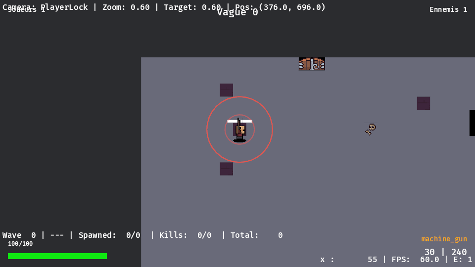
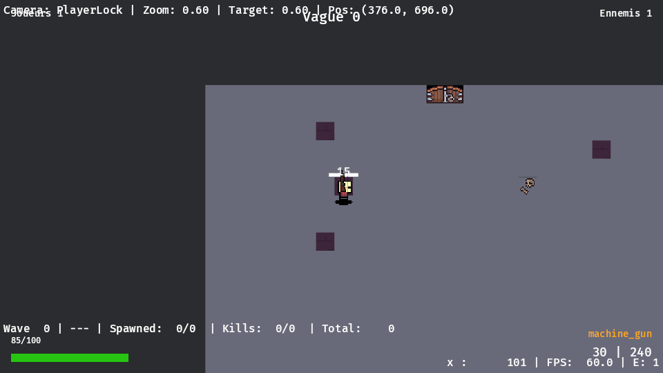
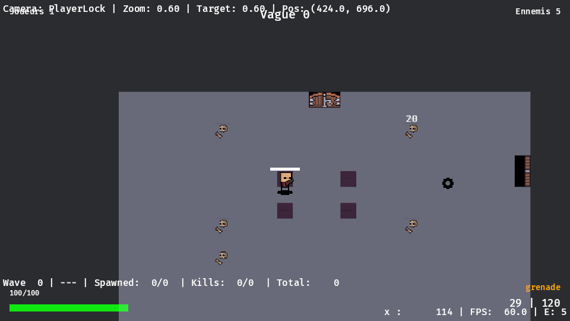
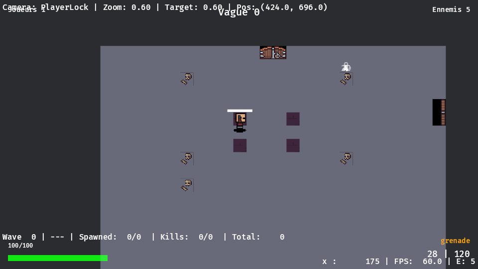

# Rapport m1-v4-feedback-v1 — feedback v1 : hit stop, secousse, flash, télégraphe, chiffres (T1.17)

**Branche** `m1-v4-feedback-v1`, partie de la tête livrée de m1-throne-gen-et-d40 `226e8aa` ;
`origin/main` mergé avant la compilation (`5cad4b3`) puis après le merge de throne (`26f1496`,
traces throne bénies). Fiche : `docs/taches/m1-v4-feedback-v1.md`.

## État en cours

- **Fait** : code, tests, preuve sans écran, suite, conventions (§31 + une ligne au §9),
  captures hors écran (§5). Livré.
- **Target** purgé après la suite (incremental et examples supprimés, une génération par
  crate ; target 40G, /home 86G libres) ; quatre images clés versionnées (§5), captures complètes hors dépôt (`alacod_tasks/<tâche>/d40/captures/`, vidéos dans
  `target/videos/2984bbc/`).

## 1. Décisions (confirmées à orch, amendements acceptés)

1. **Hit stop** : `animation::AnimationFreeze` (ressource de présentation), compté en **ticks de
   rendu** (avancé en `First`) ; `animate_sprite_system` n'avance plus timers ni images et
   `camera_control_system` ne suit plus pendant le gel. `Time<Virtual>` jamais touché : la
   simulation (rollback, p2p) continue.
2. **`feedback.ron` étendu** : type partagé `content::feedback::FeedbackSettings` (le jeu
   l'enveloppe en asset `FeedbackConfig`, `#[serde(transparent)]` ; le lint lit le même type au
   lieu de l'ancien miroir) : `hit_stop_frames`, `damage_numbers`, `telegraph.color`,
   `by_kind: {DamageKind: …}`, `by_weapon: {"arme": …}` (surcharges optionnelles
   `hit_stop_frames`/`hit_flash`/`shake`), résolution champ par champ arme > genre > défaut
   (`resolve`, 3 unitaires). Ancien format accepté tel quel (champs nouveaux par défaut).
   Lint : frames > 0, amplitude ≥ 0, couleur du flash dans `[0, 4]`, télégraphe dans `[0, 1]`,
   armes de `by_weapon` connues ; fixtures `feedback_by_weapon_unknown`,
   `feedback_override_out_of_range`.
3. **Télégraphe au sol** (`telegraph_shape`, lecture seule, 2 unitaires) : `Charge` en phase
   `Telegraph` → cercle au point visé figé, rayon `attack_range` ; émetteur
   (`Emitter::telegraphing`) → cercle autour du porteur, rayon la plus grande portée de sa table
   de projectiles. Gizmos : contour + disque intérieur qui grandit jusqu'au déclenchement.
4. **Flash** : corrigé — il cherchait un `Sprite` sur l'entité racine (qui n'en a pas). Un seul
   système `apply_layer_colors` colore les **calques enfants** : flash en cours, sinon teinte du
   statut (T1.3), sinon blanc. Second défaut trouvé : un flash `(1, 1, 1)` multiplie par 1, il
   était invisible même sur le bon sprite → couleur par défaut `(2.5, 2.5, 2.5)` (surexposition)
   dans les trois jeux.
5. **Preuve sans écran** : `FeedbackPlugin` était entièrement coupé en headless ; scindé en
   `FeedbackLogPlugin` (toujours actif : charge la config, remplit `FeedbackLog`) et
   `FeedbackPlugin` (rendu : applique les indices du journal, dessine, joue les sons). Le
   journal ne traite que les **nouvelles** frames simulées (`FrameCount` > dernière frame
   journalisée : pas de doublon quand un rollback rejoue des frames, consigne d'orch).
   Moments clés `feedback` (`scenario::events::feedback_events`) pour télégraphe, hit stop,
   secousse (flash et chiffre accompagnent chaque coup : pas de moment clé).
6. Hors périmètre : sons (D32), particules, écran de mort.

**Règles de déclenchement** (§31) : flash et chiffre par coup ; par frame, au plus une secousse
(cible = joueur local, ou tireur = joueur local quand la secousse vient d'une surcharge : impact
lourd) et un hit stop (source ou cible = joueur local), le plus fort de la frame. **Limite
connue** (écrite au §31, consigne d'orch) : `DamageEvent` ne porte pas l'arme (il est tracé) ;
l'arme retenue est l'émetteur de la source, sinon son arme active au moment du coup ; aucune
pour la mêlée. Les projectiles infligent aujourd'hui des dégâts `Physical` : les explosifs se
règlent par `by_weapon` (`grenade` dans testbed ; `lance_grenades`, `roquette`,
`fusil_a_pompe` dans throne).

**Secousse** : retire son décalage du tick précédent avant d'appliquer le suivant (sinon les
décalages s'additionnent quand la caméra ne suit plus pendant un hit stop) ; la décroissance
utilisait l'amplitude au lieu de la durée (`remaining / (amplitude + 1)`), corrigée
(`remaining / frames`).

## 2. Preuve sans écran

Attentes `Event(kind: "feedback", …)` ajoutées à des scénarios existants (elles ne touchent pas
aux traces) :

- **`enemy_charge`** : « télégraphe 27 (29 frames, rayon 40) » à **f42** (début du télégraphe de
  la ruée), « hit stop 22 (2 frames) » et « secousse 22 (8 frames) » à **f100** (contact,
  joueur local touché).
- **`weapon_grenade`** (testbed, généré : `test.expect` de la grenade) : « secousse 35 (16
  frames) » et « hit stop 35 (6 frames) » à **f113** (première explosion, surcharge
  `by_weapon: "grenade"`). `make gen GAME=testbed` : 36/36 `ok`, seul `weapon_grenade.ron`
  change (attentes), trace `ok`.

## 3. Vérifié

- **Suite des crates** (`scenario run combat game content map_ldtk map sim_core stats bots
  effects utils behaviors world animation`, `--include-ignored`) avant le second merge : 527
  verts ; échecs : `scenarios` uniquement sur les traces throne pas encore présentes dans la
  branche (bénies par orch dans main ensuite) et le doctest `rust,ignore` de `game::waves`
  (préexistant). **Après le merge de `26f1496`** : voir §4.
- **Aucune trace bénie**, aucune trace modifiée par la tâche.
- Unitaires : `content::feedback` (3), `game::feedback::telegraph_tests` (2),
  `animation::freeze_tests` (2), fixtures de lint (2 nouvelles).
- **`make lint`** : zombies, testbed, throne sans erreur. **`fmt`** (commit dédié),
  **`check_forbidden`** 4 occurrences (identique), **`check_rollback_registration`** OK,
  **exemples racine** compilés.

## 4. Après le merge de main

`origin/main` `26f1496` mergé (`cd587fd` : traces throne bénies par orch, aucun code nouveau) :
test `scenarios` **vert** (tous les scénarios, générés zombies/testbed/throne compris, 793 s),
**sans bless** : le feedback est bien hors simulation et hors trace.

## 5. Captures hors écran

`play_scenario --features render` (`--profile headless`, au feu vert render d'orch, seul sur la
machine), `--capture --every 1` : `enemy_charge` (201 images) et `weapon_grenade` (601 images) ;
vidéos `target/videos/2984bbc/enemy_charge.mp4` et `weapon_grenade.mp4` (30 images/s : demi-
vitesse, une image par frame de simulation).

- **`enemy_charge`** : f55, **cercle de télégraphe** rouge au point visé (le joueur), contour
  de rayon 40 et disque intérieur qui grandit ; f101, **chiffre « 15 »** au-dessus du joueur,
  **joueur surexposé** (flash sur les calques), **caméra décalée** (secousse : l'arène se
  déplace d'environ 12 px). Différence d'image : 100 à 200 pixels changés par frame avant le
  coup, 18 000 à 29 000 de f99 à f104 (secousse), qui décroît ensuite.
- **`weapon_grenade`** : f114, **chiffre « 20 »** au-dessus de la cible touchée par
  l'explosion, secousse de surcharge visible.

Images versionnées (`docs/taches/rapports/m1-v4-feedback-v1/`) :

- 
  `enemy_charge` f55 : cercle de télégraphe au point visé.
- 
  `enemy_charge` f101 : contact, chiffre « 15 », flash, caméra décalée (secousse ; hit stop en
  cours).
- 
  `weapon_grenade` f114 : chiffre « 20 » sur la cible, secousse de surcharge.
- 
  `weapon_grenade` f175 : les 8 éclats sur la même cible, chiffres empilés (limite, §6).

## 6. Écarts, non fait / incertain

- Le **gel des animations** pendant le hit stop (2 ticks) n'est pas isolable sur les captures :
  la secousse, au même moment, change bien plus de pixels. Prouvé par le journal et par
  l'unitaire d'`AnimationFreeze`, pas à l'image.
- **Chiffres superposés** : les 8 éclats d'une grenade qui touchent la même cible à la même
  frame affichent 8 « 4 » au même endroit (illisible, f175). Petite suite possible : décaler
  les chiffres d'une même cible dans une frame, ou les cumuler. Non corrigé (recompilation du
  rendu, machine rendue à orch).
- Le hit stop est **local** (ticks de rendu de cette machine) : deux joueurs en p2p ne gèlent pas
  au même instant réel ; c'est voulu (présentation).
- Chiffres de dégâts : police `fonts/FiraMono-Medium.ttf` (présente dans les trois jeux),
  taille 10, montée 30 px/s sur 0,7 s.
